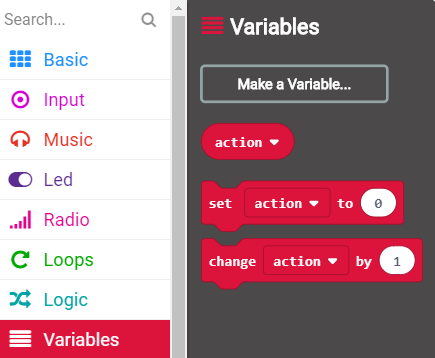
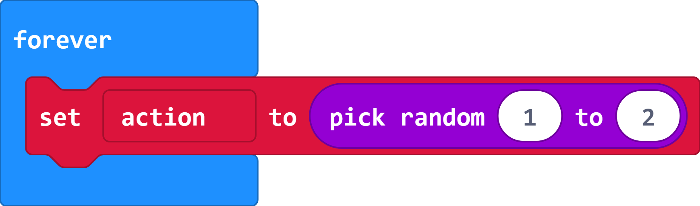
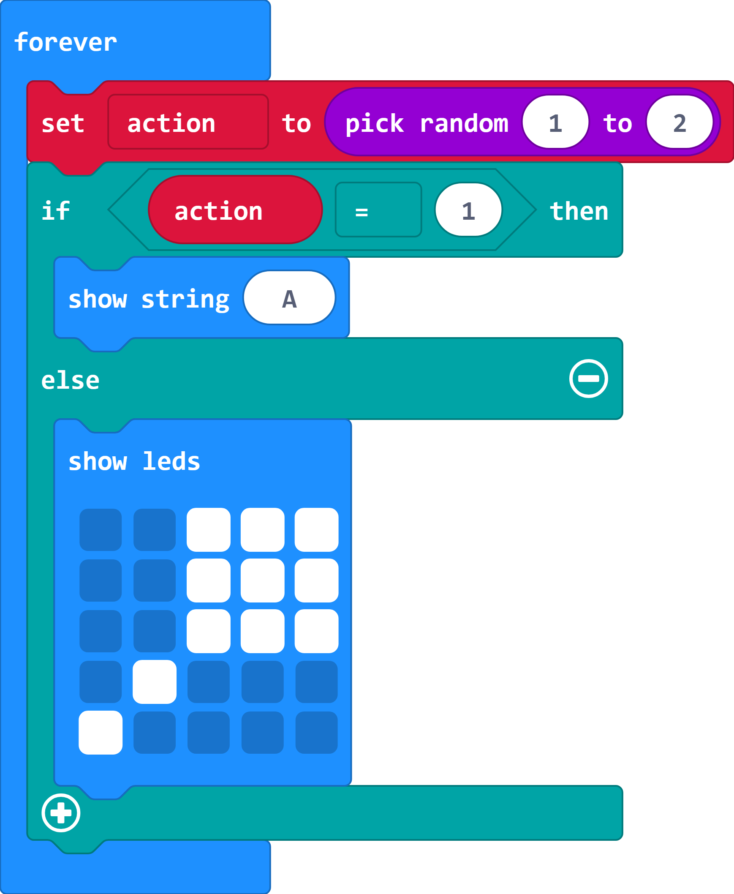

## Display an action

The micro:bit has a display of 25 red LED lights that provide an **output**. You will program the display to show an action for the player to perform. 

You'll start with showing a letter 'A' to tell the player to press the 'A' button on the micro:bit or a maraca (shaker) to show that they need to shake the micro:bit.

+ Open the MakeCode editor using this link: rpf.io/makecode. 

+ Add a new variable to store the action that the player needs to take:

  

  New blocks will be added to the `Variables`{:class="microbitvariables"} section to set and change the `action`{:class="microbitvariables"} variable.

+ Add code to your `forever`{:class="microbitbasic"} loop to randomly choose an action: 1 for the A button and 2 for a shake. 

  

+ Add code to the bottom of your `forever`{:class="microbitbasic"} loop to display an image corresponding to the chosen action: 

  

  Click on the squares in the `show leds`{:class="microbitbasic"} block to make the maraca image.

+ Your code will automatically run in the simulator. You should randomly see either the letter 'A' or a maraca (shaker) image. 
