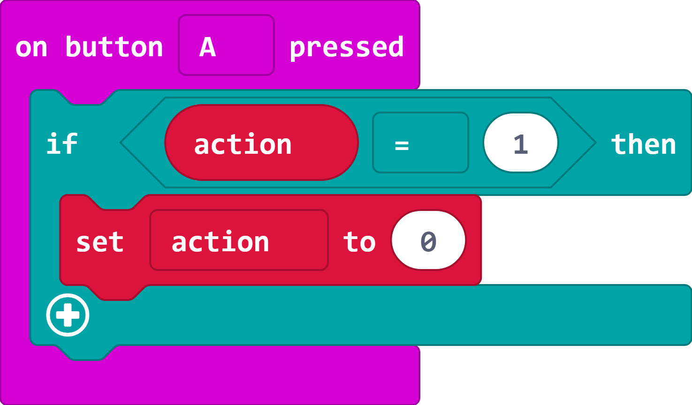
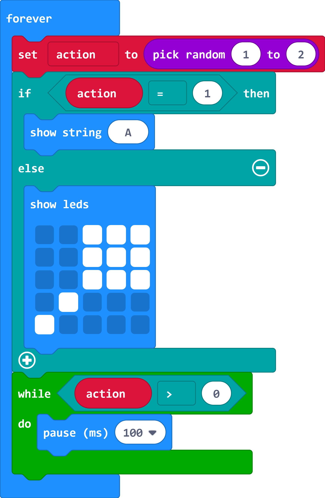
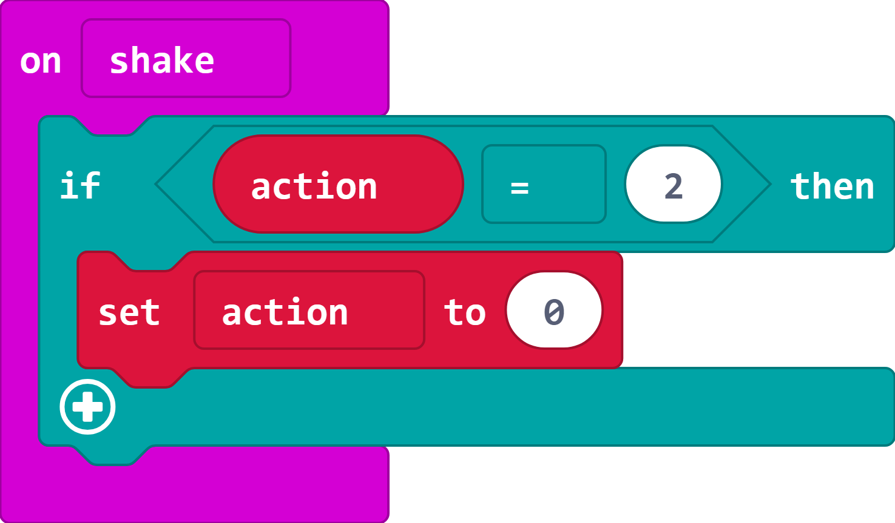

## Get Input

Next you will add code to detect when the player provides **input** by pressing the A button or shaking the micro:bit. 

+ Add code to detect when the 'A' button is pressed and set the `action` variable to 0 to show that the action has been completed. This should only be done if the current action is 1 (A button).

  

+ Now add code to the bottom of your `forever` loop to wait until the `action` variable gets set to 0 so that the player needs to complete the action before seeing another action. 

  

+ You'll also need to detect the shake action. Note that this time you need to check that the current action is 2 (shake).

  

+ Now you can test your game in the simulator. If you see an A then press the A button, if you see a maraca then click Shake. 

  Note that you can get the same action twice so if you see the same action again then you need to repeat it. 

+ You can also try your game on your micro:bit. Connect it to your computer with a USB cable. 

+ Click settings and then 'Pair device'.

+ Click Download to transfer your code to the micro:bit. From now on you can just click Download to transfer your code. 

+ Test your code on the micro:bit.

