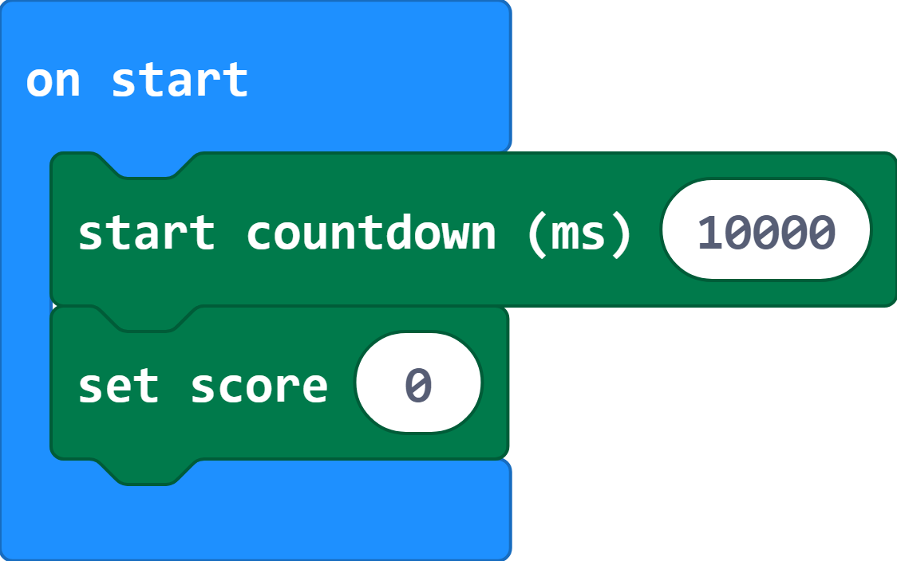
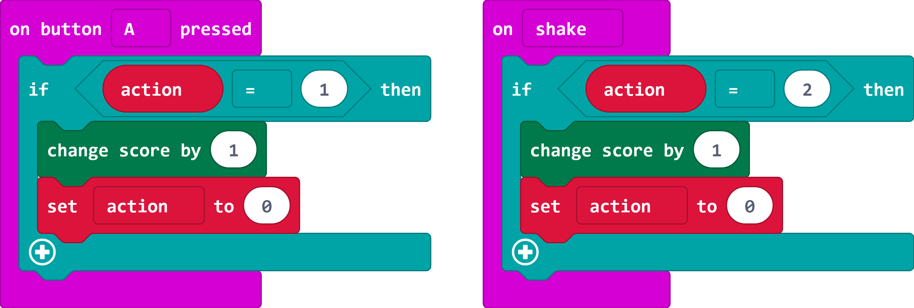

## Keep score

Next you will turn your project into a game with a timer and a score. The MakeCode editor includes `Game` blocks to help you do this.

+ The `Game` section includes a `countdown`{:class="microbitgame"} blocks which starts a timer. The default amount of time is 10000 milliseconds, or 10 seconds. This is fine for testing your game, you can increase it later. There's also a `score`{:class="microbitgame"} variable which you should set to 0 at the beginning of a game.

  Add code to set up the game to the `start`{:class="microbitbasic"} block.

  

+ Your code will automatically run in the simulator. Notice that there's an animation at the beginning of the game, and after 10 seconds then game will finish and show 'GAME OVER' and your score. 

+ At the moment, the score will always be 0. You can fix that by adding a `change score`{:class="microbitgame"} block when you detect a correct input. You'll need to do this for the A button and shake actions.

  

+ Now test your game and you will see a score at the end. You will also see a short animation when the score increases.

+ To play the game again, press the reset button on the back of the micro:bit. 

+ You can change the timer to give yourself more time. 60000 milliseconds is one minute. 

+ Now play the game with two people. Pass the micro:bit to the other player each time you complete an action. You can play in larger groups too. 

