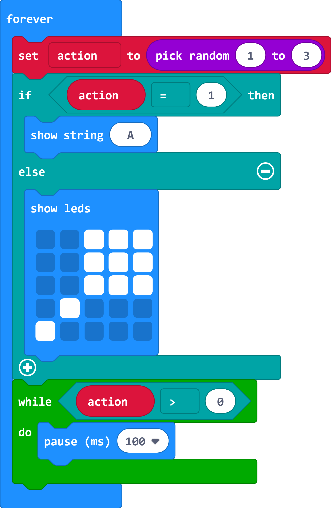
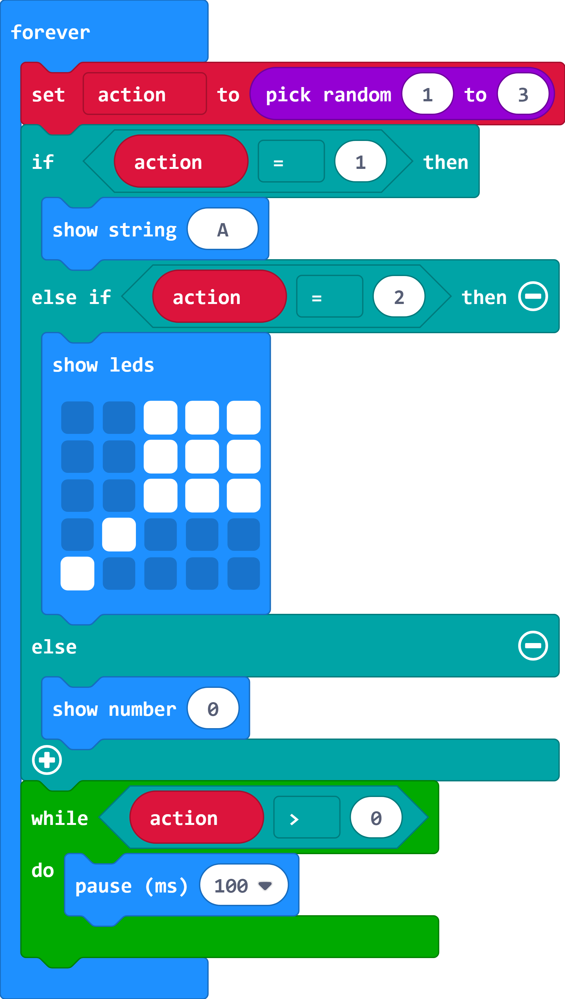
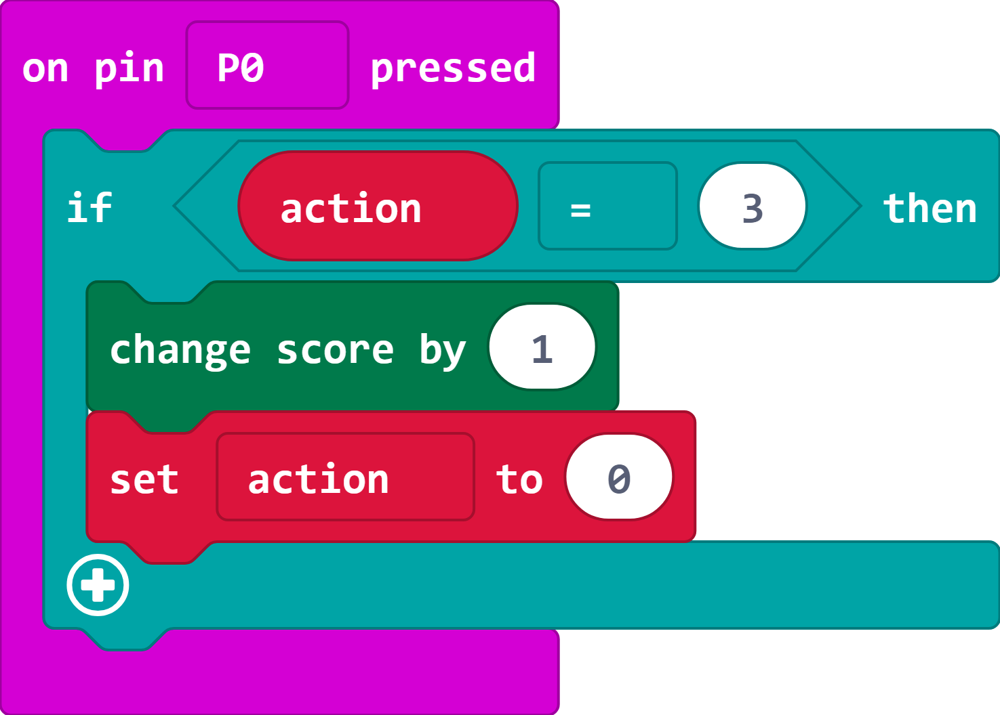
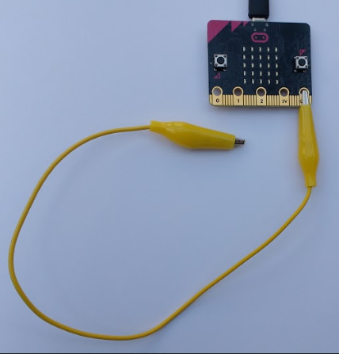

## More input actions!

At this point you have a complete game, but it only has two different actions. Next you'll add another action, connecting and then releasing or 'pressing' pin 0. The player will provide this input by connecting a crocodile clip lead from GND to pin 0. 

Once you've done that you can have a go at adding your own actions.

+ Change your `pickrandom`{:class="microbitmath"} block so that it chooses a number between 1 and 3. 

  

+ Add an `else if`{:class="microbitlogic"} section to your action output code by clicking on the plus button. 

  Change your code so that it displays the maraca if the action is 2 and add a `show number`{:class="microbitbasic"} block to the else section to display a 0. 

   

+ Now add code to detect that Pin 0 has been connected and then released (pressed).

  

+ You can test your code in the simulator by clicking on Pin 0 when a '0' is shown on the display. 

+ Download your code to your micro:bit. 

+ Connect one end of a crocodile clip lead to GND. 

  

+ Test your game. When a '0' appears on the display, tap the other end of the crocodile clip lead on the 0 pin. 

  If you don't have a crocodile clip lead then you can hold the GND pin with one hand and then touch and release pin 0 with the other hand. This works because you skin is conductive (if it doesn't work then you might need to drink more!)
  
+ Now try and add an action of your own. Each of the `input`{:class="microbitinput"} blocks you have used has a drop-down with other options. For each action you'll need to:

  + Increase the maximum in the `pick random`{:class="microbitmath"} block by one.
  + Add another `else if`{:class="microbitlogic"} section to display an image for your action
  + Add an `input`{:class="microbitinput"} block and code to detect when the action is correctly performed. 

