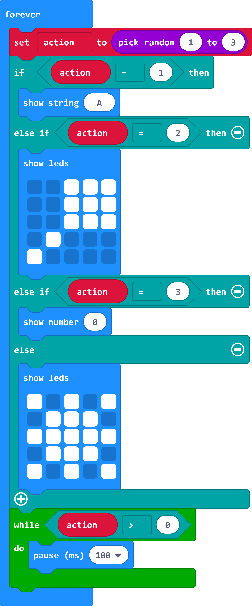
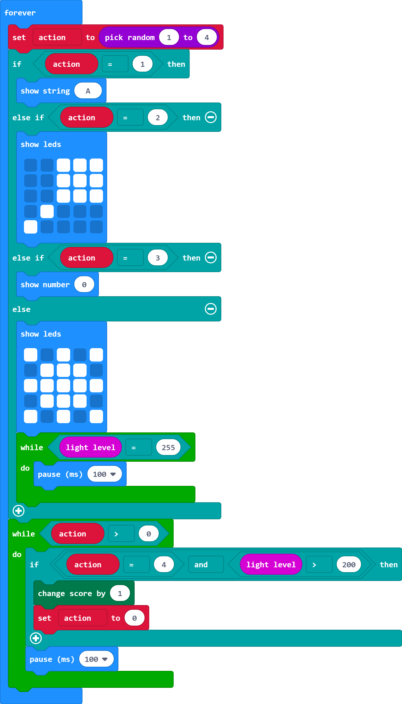

## Light!

You can also use readings from micro:bit sensors as inputs. You're going to add another action to detect when a bright light is shone on the micro:bit. You'll need a torch (or a mobile phone with a torch option).

+ Increase the maximum in your `pick random`{:class="microbitmath"} by one to increase the number of possible actions. This number will depend on how many actions you have added. 

+ Add an `else if`{:class="microbitlogic"} section to your action output code by clicking on the plus button. 

  Change your code so that you have an extra action for shining a torch on the micro:bit.  

   

   You can design a different image if you like. 

+ The `light level` variable returns a number from 0 (dark) to 255 (bright). When you first use the light sensor on the micro:bit it returns 255 initially so we need to wait until the number drops. (This also means that you can't just shine a light on the micro:bit all of the time and cheat!)

  

+ Now add code to check for the light level being high when the corresponding action is selected:

  

+ Download your code and test your game. When the light symbol appears, shine a torch on the micro:bit. 

  If you are playing in bright sunlight then you might want to adapt the game so that the action is making it dark by covering the micro:bit display. 

+ Adjust the amount of time if you need longer to play. 

